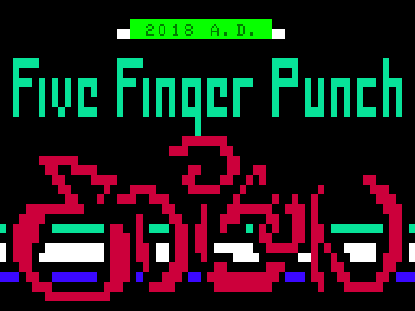

# 2018 A.D. by Five Finger Punch

This is a demo for Laser 200, an 8 bit computer with 4 KB of RAM (2 KB of which is video RAM).
The computer was sold under different names in different countries: Salora Fellow, Dick Smith VZ 200, Seltron 200 and Texet TX800.

This demo competed in the demo competition at the Edison 2018 party where it received a shared 1st prize.



## Credits

Code: Morbid, Imodium, vilcans

Music: vilcans

Graphics: Corel

## Links

Video: https://www.youtube.com/watch?v=tlMpiV3P8YY

Download and comments: https://www.pouet.net/prod.php?which=77129

## About the demo

The Laser 200 used casette tapes for storage.
For the demo we instead burned the data to a CD.
This allowed us to use a speedloader to load data from the audio
at a higher rate than would be feasible with a tape deck.

We could have used a PC for playing the audio instead of CD,
but we wanted to use technology contemporary with the computer,
and the compact disk standard was released in 1982.

While the Laser 200 does have a beeper speaker and
can output sound on the casette port, that requires the CPU to focus almost solely on this, 
so there wouldn't be much time left for effects.
For this reason we also set up the CD audio so that the left channel would contain the data for the demo,
and the right channel would be the music.
With a stereo split cable, the demo with speedloading and music can be played together.
The music is made to trick the audience at first that the sound is coming from the Laser 200,
to later realize that that is not possible.

## Building and running

These are quick instructions. Probably incomplete, so let me know if you can't figure it out.

Requirements:

  * GNU Make
  * Python 2.x with the Pillow package installed.
  * The software mentioned under [Missing files](#missing-files)

To build the final wav file, including music:

    make compile    

After this the final file is `compile/combined.wav`. Create an audio cable which directs the left channel audio to the tape input of the Laser 200, and the right channel to a speaker. Plug it in, load, play and enjoy!

If you don't have a cable or other way to split the audio channels, you can play `compile/data.wav` into the Laser's tape input, but then you won't get any music.

## Development

To work on a specific part, enter the directory of any part and run it in Mame. For example to try the part "helix", run:

    cd helix
    make mame

You can also make a wav file that can be loaded onto a device with:

    make helix.wav

The above requires Dosbox to run VZ2WAV.

To create a speedloaded wav that can be quickly loaded onto the computer:

    make helix-speed.wav

## Missing files

This is a copy of our internal repository that we used during development, but with history and third party files removed, to avoid any issues with licensing and embarrasing old commits.

The build scripts expect the following files.

Volker Barthelmann's Vasm and Vlink programs (built for three different platforms):

```
bin/osx/vasmz80_oldstyle
bin/osx/vlink
bin/win/vasmz80_oldstyle.exe
bin/win/vlink.exe
bin/win/vobjdump_win32.exe
bin/LINUX64/vasmz80_oldstyle
bin/LINUX64/vlink
```

We used Mame as emulator, which expects the following file (with ROM code):

```
third_party/mame_vz200/vz200.zip
```

We also used Vzem as emulator during development. Some make targets expect Vzem emulator in a subdirectory, where we had the following files, not all of which are needed obviously:

```
third_party/vzem/vzrom.v21
third_party/vzem/forest.asm
third_party/vzem/vz.exe
third_party/vzem/forest.vz
third_party/vzem/vzem.cfg
third_party/vzem/Manual - xb2.htm
third_party/vzem/readme.txt
third_party/vzem/blank.dsk
third_party/vzem/Vzdos.rom
third_party/vzem/demotape/04.vz
third_party/vzem/demotape/09.vz
third_party/vzem/demotape/README
third_party/vzem/demotape/12.vz
third_party/vzem/demotape/05.vz
third_party/vzem/demotape/11.vz
third_party/vzem/demotape/10.vz
third_party/vzem/demotape/01.vz
third_party/vzem/demotape/13.vz
third_party/vzem/demotape/07.vz
third_party/vzem/demotape/06.vz
third_party/vzem/demotape/02.vz
third_party/vzem/demotape/14.vz
third_party/vzem/demotape/08.vz
third_party/vzem/demotape/03.vz
third_party/vzem/demotape/15.vz
third_party/vzem/demotape/00.vz
third_party/vzem/vzrom.v20.orig
third_party/vzem/extbasic.dsk
```

DOS program VZ2WAV, used for converting data to tape audio:

```
bin/dos/vz2wav.exe
```
